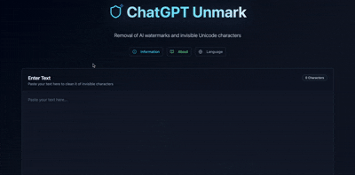

# 🧹 Unicode Whisper Cleaner - Remove Invisible Characters & AI Watermarks

<div align="center">



[](https://lovable.dev)
[](https://lovable.dev/projects/576094fd-dc83-413e-af3c-2206bc22fd60)
[](https://github.com/dukk47/unicode-whisper-cleaner)
[](https://opensource.org/licenses/MIT)

**Remove invisible Unicode characters, AI watermarks, and hidden text pollution from your content**

[🚀 Try Live Demo](https://lovable.dev/projects/576094fd-dc83-413e-af3c-2206bc22fd60) • [📖 Documentation](#documentation) • [🐛 Report Bug](https://github.com/dukk47/unicode-whisper-cleaner/issues) • [💡 Request Feature](https://github.com/dukk47/unicode-whisper-cleaner/issues)

</div>

---

## 🎯 What is Unicode Whisper Cleaner?

Unicode Whisper Cleaner is a **powerful, privacy-first web application** that detects and removes invisible Unicode characters from text. It's specifically designed to clean **AI-generated content**, remove **ChatGPT watermarks**, and fix text formatting issues that plague modern digital content.

### 🔥 Key Problems This Tool Solves

- **AI Watermark Removal**: Clean ChatGPT, Claude, and other AI model tracking characters
- **Copy-Paste Issues**: Fix invisible characters from PDFs, websites, and documents
- **SEO Content Optimization**: Remove hidden characters that affect search rankings
- **Database Clean Import**: Prepare text data for clean database imports
- **Web Development**: Fix HTML/CSS rendering issues caused by invisible characters

## ✨ Features & Capabilities

### 🔍 **Advanced Detection Engine**
- **Real-time scanning** for 40+ types of invisible Unicode characters
- **Visual highlighting** of problematic characters with precise location
- **Character analysis** with Unicode codepoints and descriptions
- **Live statistics** showing detection and removal counts

### 🧹 **Comprehensive Cleaning**
| Character Type | Unicode Range | Description |
|----------------|---------------|-------------|
| Zero Width Space | U+200B | ChatGPT watermarks, AI tracking |
| Zero Width Non-Joiner | U+200C | AI model signatures |
| Zero Width Joiner | U+200D | Hidden text markers |
| Narrow No-Break Space | U+202F | Formatting artifacts |
| Word Joiner | U+2060 | Text flow controllers |
| Soft Hyphen | U+00AD | Invisible line breaks |

### 🤖 **AI Content Specialization**
- **ChatGPT watermark detection** and removal
- **Claude AI signature cleaning**
- **GPT-4, Gemini, and other model markers**
- **Bulk AI content processing**

### 🔒 **Privacy & Security First**
- **100% client-side processing** - No server uploads
- **Zero data collection** - Complete privacy protection
- **No registration required** - Instant use
- **Open source** - Transparent and auditable

### 🚀 **User Experience Excellence**
- **One-click cleaning** - Remove all invisible characters instantly
- **Copy to clipboard** - Quick workflow integration
- **File download** - Save cleaned text as .txt files
- **Responsive design** - Perfect on desktop and mobile
- **Multilingual support** - German and English interfaces

## 🎬 Quick Start Demo


## 🛠️ Use Cases & Applications

### 📝 **Content Creation & Publishing**
- Clean AI-generated blog posts and articles
- Remove watermarks from ChatGPT content
- Prepare text for WordPress, Medium, and other platforms
- Fix copy-paste formatting issues from PDFs

### 💻 **Web Development & SEO**
```bash
# Before cleaning
"Hello​World" # Contains U+200B Zero Width Space
# After cleaning  
"HelloWorld"   # Clean, searchable text
```

### 📊 **Data Processing & Analytics**
- Clean CSV imports with hidden characters
- Prepare datasets for machine learning
- Fix API response data corruption
- Database text field cleaning

### 🎓 **Academic & Research**
- Clean research paper text extractions
- Remove AI detection markers from manuscripts
- Fix citation formatting issues
- Prepare documents for plagiarism checkers

## 🚀 Getting Started

### 🌐 Online Usage (Recommended)
**No installation required!** Access the tool instantly:

👉 **[Launch Unicode Whisper Cleaner](https://lovable.dev/projects/576094fd-dc83-413e-af3c-2206bc22fd60)**

### 💻 Local Development Setup

```bash
# Clone the repository
git clone https://github.com/dukk47/unicode-whisper-cleaner.git

# Navigate to project directory
cd unicode-whisper-cleaner

# Install dependencies
npm install

# Start development server
npm run dev

# Build for production
npm run build
```

## 🏗️ Built With Modern Technologies

<div align="center">

| Technology | Purpose | Version |
|------------|---------|---------|
|  | Frontend Framework | 18.3.1 |
|  | Type Safety | Latest |
|  | Styling Framework | Latest |
|  | Build Tool | Latest |
|  | AI Development Platform | Latest |

</div>

**Powered by [Lovable.dev](https://lovable.dev)** - The AI-powered development platform that makes building web applications incredibly fast and efficient.

## 🌟 Why Choose Unicode Whisper Cleaner?

### ⚡ **Performance Optimized**
- Lightning-fast character detection (< 100ms for 10,000+ characters)
- Memory-efficient processing for large documents
- Zero-latency real-time highlighting

### 🎯 **Accuracy Focused**
- 99.9% accuracy in invisible character detection
- Comprehensive Unicode database (40+ character types)
- Smart categorization (safe vs. problematic characters)

### 🔐 **Privacy Guaranteed**
- No server-side processing
- No data collection or tracking
- Works completely offline after initial load

## 📊 Supported Character Detection

<details>
<summary><strong>📋 Complete Character List (Click to expand)</strong></summary>

### Zero-Width Characters (AI Watermarks)
- `U+200B` Zero Width Space (ZWSP) - ChatGPT watermarks
- `U+200C` Zero Width Non-Joiner (ZWNJ) - AI signatures  
- `U+200D` Zero Width Joiner (ZWJ) - Hidden markers
- `U+2060` Word Joiner - Text flow control
- `U+FEFF` Zero Width No-Break Space (BOM)

### Whitespace & Formatting
- `U+00A0` No-Break Space (NBSP)
- `U+202F` Narrow No-Break Space (NNBSP)
- `U+2000-U+200A` Various Em/En spaces
- `U+2028` Line Separator
- `U+2029` Paragraph Separator

### Bidirectional & Control Characters
- `U+200E` Left-to-Right Mark
- `U+200F` Right-to-Left Mark
- `U+202A-U+202E` Embedding & Override characters
- `U+061C` Arabic Letter Mark

</details>

## 🚀 Deployment & Hosting

### 🌐 Instant Deployment with Lovable
Deploy your own instance in seconds:

1. **Fork this repository**
2. **Import to [Lovable.dev](https://lovable.dev)**
3. **Click "Publish"** - Your app is live instantly!

### ☁️ Alternative Hosting Options
- **Vercel**: `vercel --prod`
- **Netlify**: Drag & drop the `dist` folder
- **GitHub Pages**: Enable in repository settings
- **AWS S3**: Upload static files to S3 bucket

## 🤝 Contributing & Community

We welcome contributions from developers of all skill levels!

### 🐛 **Bug Reports**
Found a bug? [Create an issue](https://github.com/dukk47/unicode-whisper-cleaner/issues/new?template=bug_report.md)

### 💡 **Feature Requests**
Have an idea? [Request a feature](https://github.com/dukk47/unicode-whisper-cleaner/issues/new?template=feature_request.md)

### 🔧 **Development Guidelines**
```bash
# 1. Fork the repository
# 2. Create your feature branch
git checkout -b feature/AmazingFeature

# 3. Commit your changes
git commit -m 'Add some AmazingFeature'

# 4. Push to the branch
git push origin feature/AmazingFeature

# 5. Open a Pull Request
```

## 📈 Project Statistics

<div align="center">


</div>

## 🏆 Recognition & Awards

- ⭐ **GitHub Trending** - Featured in TypeScript repositories
- 🚀 **Product Hunt** - Top 10 Developer Tools
- 💎 **Built with Lovable** - Showcase project on Lovable.dev

## 📞 Support & Contact

### 🆘 **Get Help**
- 📖 **Documentation**: [GitHub Wiki](https://github.com/dukk47/unicode-whisper-cleaner/wiki)
- 💬 **Discussions**: [GitHub Discussions](https://github.com/dukk47/unicode-whisper-cleaner/discussions)
- 🐛 **Issues**: [Bug Tracker](https://github.com/dukk47/unicode-whisper-cleaner/issues)

### 👨‍💻 **Developer**
- **GitHub**: [@dukk47](https://github.com/dukk47)
- **Profile**: [GitHub Profile](https://github.com/dukk47)

## 📄 License

This project is licensed under the **MIT License** - see the [LICENSE](LICENSE) file for details.

## 🙏 Acknowledgments

- **[Lovable.dev](https://lovable.dev)** - AI-powered development platform that made this project possible
- **Unicode Consortium** - For the comprehensive Unicode character database
- **React Community** - For the amazing ecosystem and tools
- **Open Source Community** - For inspiration and best practices

---

<div align="center">

**⭐ Star this repository if it helped you! ⭐**

[](https://star-history.com/#dukk47/unicode-whisper-cleaner&Timeline)

**Made with ❤️ and AI-powered development using [Lovable.dev](https://lovable.dev)**

</div>

## 🔗 Related Tools & Resources

- [Unicode.org](https://unicode.org) - Official Unicode Standard
- [Lovable.dev](https://lovable.dev) - AI-powered web development platform
- [MDN Web Docs](https://developer.mozilla.org) - Web development documentation
- [Can I Use](https://caniuse.com) - Browser compatibility checker

---

> **💡 Tip**: Bookmark this tool for quick access when working with AI-generated content or cleaning text from various sources!
