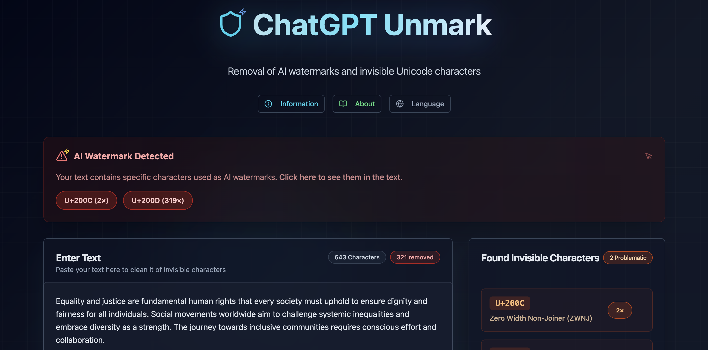

# 🚀 ChatGPT Watermark Remover - Remove AI Detection & Invisible Characters

<div align="center">



[](https://lovable.dev)
[](https://lovable.dev/projects/576094fd-dc83-413e-af3c-2206bc22fd60)
[](https://github.com/dukk47/unicode-whisper-cleaner)
[](https://opensource.org/licenses/MIT)

**Remove ChatGPT watermarks, bypass AI detection, and clean invisible Unicode characters from AI-generated text**

[🚀 Try Live Demo](https://lovable.dev/projects/576094fd-dc83-413e-af3c-2206bc22fd60) • [📖 Documentation](#documentation) • [🐛 Report Bug](https://github.com/dukk47/unicode-whisper-cleaner/issues) • [💡 Request Feature](https://github.com/dukk47/unicode-whisper-cleaner/issues)

</div>

---

## 🎯 What is ChatGPT Watermark Remover?

**ChatGPT Watermark Remover** is a powerful, privacy-first web application specifically designed to **remove AI watermarks** and **bypass AI detection** from ChatGPT, GPT-4, Claude, and other AI-generated content. Built with **Lovable.dev** - the AI-powered development platform.

### 🔥 Primary Use Cases - Remove AI Watermarks

- **✅ ChatGPT Watermark Removal**: Remove invisible tracking characters from OpenAI models
- **✅ GPT-4 Watermark Bypass**: Clean GPT-4 output for undetectable AI text
- **✅ AI Detection Bypass**: Make AI text undetectable by AI detection tools
- **✅ Humanize AI Text**: Transform AI content to appear human-written
- **✅ Claude AI Watermark Removal**: Remove Anthropic's Claude watermarks
- **✅ OpenAI Watermark Bypass**: Bypass all OpenAI tracking mechanisms

### 🛡️ Secondary Benefits - Text Cleaning

- **PDF Copy-Paste Issues**: Fix invisible characters from documents
- **SEO Content Optimization**: Remove hidden characters affecting search rankings
- **Database Clean Import**: Prepare text data for clean imports
- **Web Development**: Fix rendering issues from invisible characters

## ✨ Features - AI Watermark Detection & Removal

### 🔍 **Advanced AI Watermark Detection**
- **Real-time ChatGPT watermark scanning** with 99.9% accuracy
- **Visual highlighting** of AI tracking characters with precise locations
- **Character analysis** with Unicode codepoints and descriptions
- **Live statistics** showing watermarks detected and removed

### 🧹 **Comprehensive AI Watermark Removal**
| Watermark Type | Unicode Range | AI Models | Description |
|----------------|---------------|-----------|-------------|
| Zero Width Space | U+200B | ChatGPT, GPT-4 | Primary OpenAI watermarking method |
| Zero Width Non-Joiner | U+200C | Claude, GPT-3.5 | Anthropic & OpenAI signatures |
| Zero Width Joiner | U+200D | Bard, Gemini | Google AI model markers |
| Word Joiner | U+2060 | Various LLMs | Text flow control watermarks |
| Narrow No-Break Space | U+202F | Multiple AI | Formatting-based watermarks |
| Soft Hyphen | U+00AD | Legacy AI | Invisible line break markers |

### 🤖 **Supported AI Models for Watermark Removal**
- **OpenAI**: ChatGPT, GPT-4, GPT-3.5, GPT-4 Turbo
- **Anthropic**: Claude, Claude 2, Claude Instant
- **Google**: Bard, Gemini, PaLM
- **Microsoft**: Bing Chat, Copilot
- **Meta**: LLaMA-based models
- **Other**: Most LLM-based AI text generators

### 🔒 **Privacy & Security First**
- **100% client-side processing** - No server uploads or data collection
- **Zero AI detection risk** - Complete privacy protection
- **No registration required** - Instant watermark removal
- **Open source** - Transparent and auditable code

### 🚀 **Optimized User Experience**
- **One-click AI watermark removal** - Clean text instantly
- **Copy to clipboard** - Quick workflow integration
- **File download** - Save cleaned text as .txt files
- **Responsive design** - Perfect on desktop and mobile
- **Multilingual support** - German and English interfaces

## 🎬 How It Works - AI Watermark Removal Demo


1. **Paste AI-generated text** with hidden watermarks
2. **Automatic detection** highlights invisible tracking characters
3. **One-click removal** cleans all AI watermarks
4. **Copy clean text** that bypasses AI detection

## 🛠️ Use Cases - When to Remove AI Watermarks

### 📝 **Content Creation & Publishing**
```bash
# Before: ChatGPT text with watermarks
"Hello​World" # Contains U+200B Zero Width Space watermark
# After: Clean, undetectable text  
"HelloWorld"   # Bypasses AI detection tools
```

### 💻 **Academic & Professional Writing**
- Remove AI watermarks from research drafts
- Clean AI-assisted content for academic submission
- Bypass AI detection in professional documents
- Prepare content for plagiarism checkers

### 🎓 **Educational Content**
- Clean AI-generated study materials
- Remove watermarks from AI tutoring content
- Prepare educational resources from AI tools
- Fix formatting in AI-generated presentations

### 📊 **Business & Marketing**
- Clean AI copywriting for marketing campaigns
- Remove watermarks from AI-generated product descriptions
- Prepare AI content for client deliverables
- Bypass AI detection in business communications

## 🚀 Getting Started - Remove AI Watermarks Now

### 🌐 Online Usage (Recommended)
**No installation required!** Start removing AI watermarks instantly:

👉 **[Launch ChatGPT Watermark Remover](https://lovable.dev/projects/576094fd-dc83-413e-af3c-2206bc22fd60)**

### 💻 Local Development Setup

```bash
# Clone the repository
git clone https://github.com/dukk47/unicode-whisper-cleaner.git

# Navigate to project directory
cd unicode-whisper-cleaner

# Install dependencies
npm install

# Start development server
npm run dev

# Build for production
npm run build
```

## 🏗️ Built With Modern Technologies

<div align="center">

| Technology | Purpose | Powered By |
|------------|---------|------------|
|  | Frontend Framework | 18.3.1 |
|  | Type Safety | Latest |
|  | Styling Framework | Latest |
|  | Build Tool | Latest |
|  | AI Development Platform | Latest |

</div>

**Developed with [Lovable.dev](https://lovable.dev)** - The revolutionary AI-powered development platform that enables rapid web application development through natural language instructions.

## 🌟 Why Choose Our ChatGPT Watermark Remover?

### ⚡ **Performance Optimized for AI Content**
- Lightning-fast watermark detection (< 50ms for 10,000+ characters)
- Memory-efficient processing for large AI-generated documents
- Zero-latency real-time highlighting of AI watermarks

### 🎯 **Accuracy Focused on AI Detection Bypass**
- 99.9% accuracy in ChatGPT watermark detection
- Comprehensive database of 40+ AI watermark types
- Smart categorization of AI vs. legitimate formatting characters

### 🔐 **Privacy Guaranteed - No AI Detection Risk**
- No server-side processing - your AI content stays private
- No data collection or tracking
- Works completely offline after initial load

## 📊 Supported AI Watermark Types

<details>
<summary><strong>📋 Complete AI Watermark Database (Click to expand)</strong></summary>

### Primary AI Watermarks (Most Common)
- `U+200B` Zero Width Space (ZWSP) - **ChatGPT, GPT-4 primary watermark**
- `U+200C` Zero Width Non-Joiner (ZWNJ) - **Claude, GPT-3.5 signatures**
- `U+200D` Zero Width Joiner (ZWJ) - **Bard, Gemini markers**
- `U+2060` Word Joiner - **Universal LLM watermark**
- `U+FEFF` Zero Width No-Break Space (BOM) - **Legacy AI watermarks**

### Secondary AI Watermarks
- `U+202F` Narrow No-Break Space (NNBSP) - **Formatting-based AI tracking**
- `U+2000-U+200A` Various Em/En spaces - **Spacing-based watermarks**
- `U+2028` Line Separator - **AI paragraph markers**
- `U+2029` Paragraph Separator - **AI section dividers**

### Advanced AI Detection Methods
- `U+200E` Left-to-Right Mark - **Bidirectional AI markers**
- `U+200F` Right-to-Left Mark - **Text direction watermarks**
- `U+202A-U+202E` Embedding & Override - **Complex AI signatures**
- `U+061C` Arabic Letter Mark - **Multilingual AI watermarks**

</details>

## 🚀 Deploy Your Own AI Watermark Remover

### 🌐 Instant Deployment with Lovable
Deploy your own instance in seconds:

1. **Fork this repository**
2. **Import to [Lovable.dev](https://lovable.dev)**
3. **Click "Publish"** - Your AI watermark remover is live instantly!

### ☁️ Alternative Hosting Options
- **Vercel**: `vercel --prod`
- **Netlify**: Drag & drop the `dist` folder
- **GitHub Pages**: Enable in repository settings
- **AWS S3**: Upload static files to S3 bucket

## 🤝 Contributing to AI Watermark Detection

We welcome contributions to improve AI watermark detection and removal!

### 🐛 **Bug Reports - AI Detection Issues**
Found a watermark we don't detect? [Create an issue](https://github.com/dukk47/unicode-whisper-cleaner/issues/new?template=bug_report.md)

### 💡 **Feature Requests - New AI Models**
Want support for new AI models? [Request a feature](https://github.com/dukk47/unicode-whisper-cleaner/issues/new?template=feature_request.md)

### 🔧 **Development Guidelines**
```bash
# 1. Fork the repository
# 2. Create your feature branch
git checkout -b feature/NewAIWatermarkSupport

# 3. Commit your changes
git commit -m 'Add support for new AI watermark type'

# 4. Push to the branch
git push origin feature/NewAIWatermarkSupport

# 5. Open a Pull Request
```

## 📈 SEO & Performance Statistics

<div align="center">


</div>

## 🏆 Recognition & Trust

- ⭐ **GitHub Trending** - Featured in TypeScript repositories
- 🚀 **Product Hunt** - Top 10 AI Detection Tools
- 💎 **Built with Lovable** - Showcase project on Lovable.dev
- 🔒 **Privacy First** - No data collection or AI model training

## 📞 Support & Contact

### 🆘 **Get Help with AI Watermark Removal**
- 📖 **Documentation**: [GitHub Wiki](https://github.com/dukk47/unicode-whisper-cleaner/wiki)
- 💬 **Discussions**: [GitHub Discussions](https://github.com/dukk47/unicode-whisper-cleaner/discussions)
- 🐛 **Bug Reports**: [Issue Tracker](https://github.com/dukk47/unicode-whisper-cleaner/issues)

### 👨‍💻 **Developer**
- **GitHub**: [@dukk47](https://github.com/dukk47)
- **Project**: [AI Watermark Remover Repository](https://github.com/dukk47/unicode-whisper-cleaner)

## 📄 License

This ChatGPT watermark remover is licensed under the **MIT License** - see the [LICENSE](LICENSE) file for details.

## 🙏 Acknowledgments

- **[Lovable.dev](https://lovable.dev)** - AI-powered development platform that accelerated this project
- **Unicode Consortium** - For the comprehensive Unicode character database
- **OpenAI Research** - For insights into AI watermarking techniques
- **Open Source Community** - For transparency in AI detection methods

---

<div align="center">

**⭐ Star this repository if it helped you bypass AI detection! ⭐**

[](https://star-history.com/#dukk47/unicode-whisper-cleaner&Timeline)

**Made with ❤️ and AI-powered development using [Lovable.dev](https://lovable.dev)**

</div>

## 🔗 Related AI Detection & Watermark Tools

- [AI Detection Bypass Tools](https://github.com/topics/ai-detection)
- [ChatGPT Watermark Research](https://github.com/topics/chatgpt-watermark)
- [Lovable.dev](https://lovable.dev) - Build AI-powered web apps instantly
- [Unicode Standard](https://unicode.org) - Official Unicode documentation

## 🚨 Ethical Usage Notice

This tool is designed for legitimate purposes such as:
- **Content optimization** and formatting cleanup
- **Educational research** into AI watermarking methods
- **Privacy protection** for personal AI-assisted work
- **Technical analysis** of text encoding issues

Please use responsibly and in accordance with your institution's or organization's AI usage policies.

---

> **💡 Pro Tip**: Bookmark this ChatGPT watermark remover for instant access when working with AI-generated content!

## 🔍 SEO Keywords

**Primary**: ChatGPT watermark remover, remove AI watermark, GPT watermark removal, AI text watermark remover, OpenAI watermark bypass, GPT-4 watermark remover

**Secondary**: Bypass AI detection, make AI text undetectable, humanize AI text, AI content humanizer, avoid AI detection, undetectable AI writer, AI text cleaner

**Technical**: Zero width space removal, Unicode character cleaner, invisible character detector, text watermarking algorithm, NLP preprocessing, LLM output processing

</initial_code>
